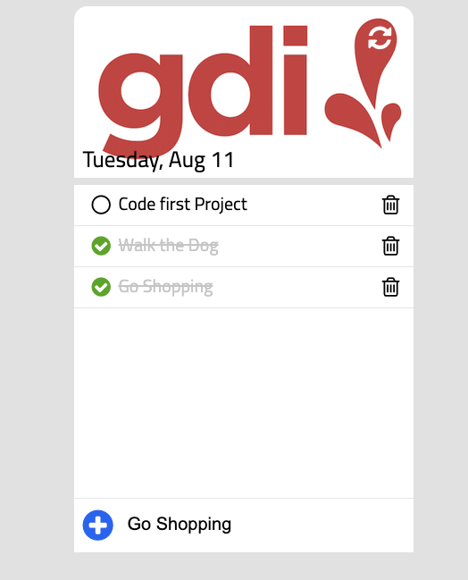

# To Do List App: 

_Building a To-do list App that will be able to perform basic CRUD operations (Create, Read Update, and delete)_

<p align="center">
  
</p>

# Install: 
```
  fork repo
  git clone https://github.com/sjoseph11236/gdi.git
  cd gdi
```

# Resources: 
- [Document.querySelector](https://developer.mozilla.org/en-US/docs/Web/API/Document/querySelector)
- [CSS Selectors](https://www.w3schools.com/css/css_selectors.asp)
- [Understanding Arrow functions](https://janhesters.com/understanding-arrow-functions/)
- [Breaking the Loop..](https://medium.com/@RhinoDavid/processing-javascript-arrays-with-foreach-map-reduce-bf40d1e5eac4)
- [Callback Function](https://developer.mozilla.org/en-US/docs/Glossary/Callback_function)